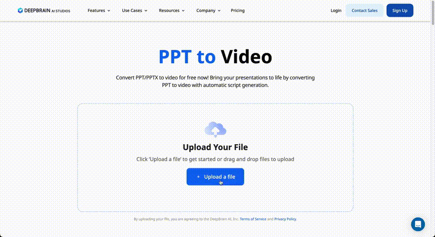
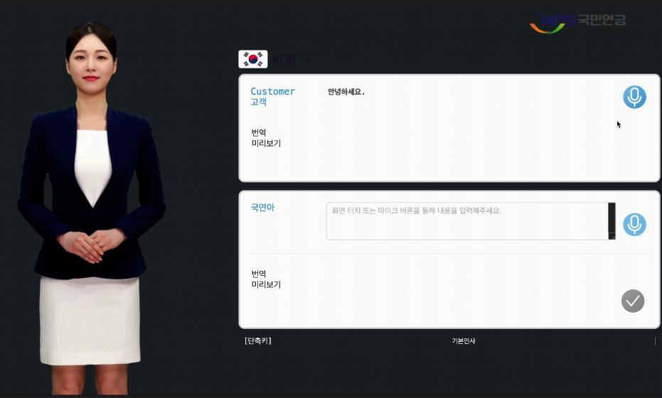
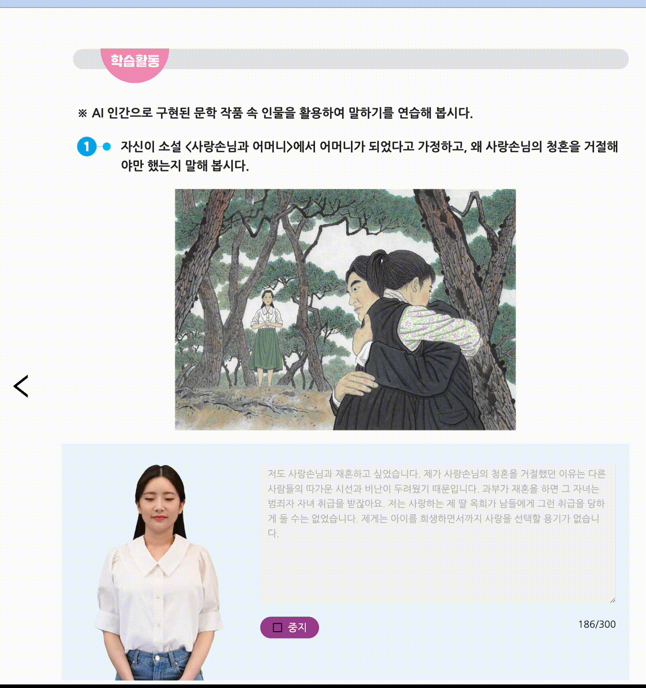
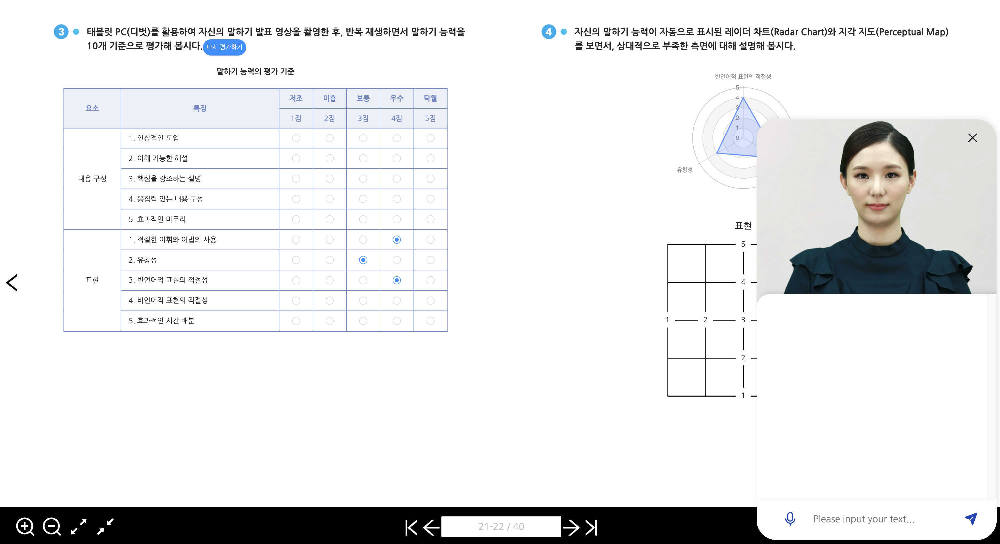
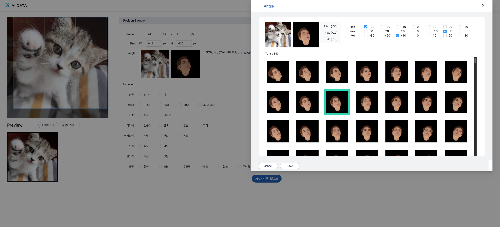
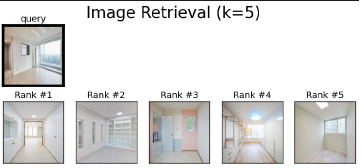
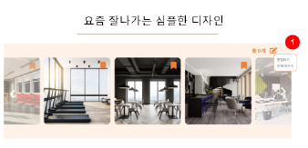
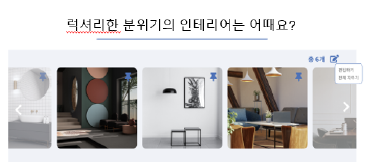

- [1. Outline](#1-outline)
  - [1.1. Profile](#11-profile)
  - [1.2. SKILLS](#12-skills)
  - [1.3. EXPERIENCE SUMMARY](#13-experience-summary)
- [2. WORK EXPERIENCE](#2-project)
  - [2.1. AI Studios v3 플랫폼 개발](#21-ai-studios-v3-개발)
    - [2.1.1 대규모 데이터 실시간 통계 및 시각화](#211-대규모-데이터-실시간-통계-및-시각화)
    - [2.1.2 요금제 확장 및 구독 해지 방어 시스템 개발](#212-요금제-확장-및-구독-해지-방어-시스템-개발)
    - [2.1.3 캔버스 기반 에디터 신규 개발 및 유지보수](#213-캔버스-기반-에디터-신규-개발-및-유지보수)
    - [2.1.4 마케팅 도구를 활용한 전략 지원 및 마케팅 캠페인](#214-마케팅-도구를-활용한-전략-지원-및-마케팅-캠페인)
    - [2.1.5 글로벌 다국어지원 및 지역화 서비스](#215-글로벌-다국어지원-및-지역화-서비스)
  - [2.2. Account 서버 설계 및 백오피스 개발](#22-account-서버-설계-및-백오피스-개발)
    - [2.2.1 자사 서비스 통합 로그인 모듈 패키지 개발](#221-자사-서비스-통합-로그인-모듈-패키지-개발)
    - [2.2.2 로그인 인증 및 어드민 기능을 담당하는 백오피스 서버 설계 및 개발](#222-로그인-인증-및-어드민-기능을-담당하는-백오피스-서버-설계-및-개발)
  - [2.3 프로젝트 개발](#23-프로젝트-개발)
    - [2.3.1 2023,2024 월드비전 꿈엽서그리기대회 AI 시상영상 제작](#231-20232024-월드비전-꿈엽서그리기대회-ai-시상영상-제작)
    - [2.3.2 KB증권 드림아바타 PoC 프로젝트 설계 및 개발](#232-kb증권-드림아바타-poc-프로젝트-설계-및-개발)
    - [2.3.3 태블릿 AI 실시간 통역 서비스 설계 및 개발](#233-태블릿-ai-실시간-통역-서비스-설계-및-개발)
    - [2.3.4 서울시 교육청 AI 디지털 교과서 프로토타입 설계 및 개발](#234-서울시-교육청-ai-디지털-교과서-프로토타입-설계-및-개발)
    - [2.3.5 국민은행 금융비서 프로젝트 개발](#235-국민은행-금융비서-프로젝트-개발)
    - [2.3.6 농협은행 AI 허브 플랫폼 프로젝트 개발](#236-농협은행-ai-허브-플랫폼-프로젝트-개발)
    - [2.3.7 AI 학습용 데이터 라벨링, 검수 플랫폼 설계 및 개발](#237-ai-학습용-데이터-라벨링-검수-플랫폼-설계-및-개발)
  - [2.4 Deepbuild Inc - ML Engineering Team](#24-deepbuild-inc---ml-engineering-team)
    - [2.4.1 인테리어 플랫폼 Pinterior 개발](#241-인테리어-플랫폼-pinterior-개발)

## 1. Outline

### 1.1. Profile

이름: 안동주

- 연락처: +82 10-6303-2184
- 이메일: andongjoo1@naver.com
- Github: https://github.com/dev-frankie

### 1.2 SKILLS

| Skills               |                                      |
| ------------------- | ------------------------------------ |
| Language            | TypeScript, Python       |
| Framework / Library | Next.js, React.js, Node.js           |
| Infra               | Docker                               |
| CI/CD               | Jenkins, ArgoCD, GitHub  Actions                      |

### 1.3 Skill Description

Frameworks & Libraries:
React와 Next.js를 활용하여 애플리케이션을 설계 및 구현하였으며, SSR를 활용해 SEO 개선

상태관리: Redux, Recoil, RTK-Query 등을 이용하여 복잡한 환경에서 전역 상태를 효과적으로 관리

테스트: Playwright를 사용한 E2E 테스트와 Vitest를 통한 단위 테스트를 도입하여, 코드의 안정성을 확보

빌드 및 성능 최적화:
Vite 를 사용하여 번들 크기를 최소화하고, 전반적인 애플리케이션 성능 향상

CI/CD: GitHub Actions CI/CD를 이용해 자동화된 빌드, 테스트, 배포 파이프라인을 구축하여 효율적이고 안정적인 개발 환경을 구축

### 1.3. EXPERIENCE SUMMARY

**Deepbrain AI** (Seoul, Korea)

>  **AI Studios v3 서비스 개발**
> 
>  - 대규모 데이터 실시간 통계 및 시각화
>  - 대규모 UI 시스템 개선
>  - 캔버스 기반 에디터 신규 개발 및 유지보수
>  - 요금제 확장 및 구독 해지 방어 시스템 개발
>  - 마케팅 도구를 활용한 전략 지원 및 마케팅 캠페인
>  - 글로벌 다국어 지원 및 지역화 서비스
>
>  **로그인 인증 통합 및 어드민 기능을 담당하는 백오피스 Account 서버 설계 및 개발**
> 
>  - 자사 서비스 통합 로그인 npm 패키지 배포
>  - 로그인 인증 및 회원가입 탈퇴 등
>  - 통합 어드민 및 백오피스 시스템 설계 및 개발
>  - 디바이스 최적화 및 UI 시스템 개선
>
>  **2023, 2024 월드비전 꿈엽서 그리기 대회 AI 시상영상 제작**
>
>  **KB증권 드림아바타 프로젝트 설계 및 개발**
>
>  **태블릿 AI 실시간 통역서비스 설계 및 개발**
>
>  **AI 디지털 교과서 설계 및 개발**
>
>  **국민은행 금융비서 프로젝트 개발**
>
>  **농협은행 AI허브 플랫폼 프로젝트 개발**
>
>  **대규모 학습용 데이터 라벨링 및 검수 플랫폼 설계 및 개발**

**Deepbuild Inc** (Seoul, Korea)

> **ML Engineering Team** _(2021-07 ~ 2022-02)_
>
>  **Pinterior 서비스 개발**
> 
>  - 상권 데이터 분석
>  - 인테리어 추천 모델 최적화 및 웹 서빙

## 2. WORK EXPERIENCE

### 2.1. AI Studios v3 개발
 AI Studios는 인공지능 합성 기술을 기반으로 사용자가 AI 가상인간을 활용해 개인화된 영상 콘텐츠를 제작하는 플랫폼입니다.

#### 2.1.1 **대규모 데이터 실시간 통계 및 시각화**

1000만건 이상의 프로젝트 데이터를 실시간으로 조회 가능한 통계 대시보드 및 데일리 리포트 자동화 시스템 구축하였습니다.

- 기여도: 100%
- Skills: Next.js, kubernetes

**문제**
- **실시간 데이터 파악의 어려움**  
  유저 유입, 프로젝트 사용 현황, 에러율 등의 통계 데이터를 실시간으로 파악하기 어려움.
  
- **분석 데이터 부재**  
  기관별, 팀별, 개인별 프로젝트 분석 데이터가 없어 운영 및 의사결정에 어려움.
  
- **대규모 데이터 조회 성능 저하**  
  1000만 건 이상의 대규모 데이터를 기간별로 검색 시 속도 저하로 인해 실시간 분석이 어려움.

**주요 역할**
- **데이터 수집 자동화**  
  - 쿠버네티스 기반 Cron 배치 프로그램을 구축하여 매일 기관별, 팀별, 개인별 프로젝트와 유저 로그 등 다양한 데이터를 수집.

- **데이터 정제 및 리포트 발송**  
  - 수집된 로우 데이터를 정제하여 운영진에게 메일 리포트를 자동 발송하는 시스템을 구현.

- **통계 대시보드 개발**  
  - 유저 사용량 통계 및 관리자용 통계 대시보드를 개발하여 실시간 데이터 조회 및 분석이 가능하도록 시스템을 구축.

**주요 성과**

- **데일리 데이터 수집 프로세스 및 리포트 시스템 구축**  

- **대규모 데이터 조회속도 개선**  
  대용량 데이터 처리 최적화를 통해 실시간 조회 가능하도록 성능을 향상

- **운영팀 데이터 기반 전략 수립 지원:**  
  제공된 실시간 통계 데이터를 바탕으로 운영팀의 의사결정 및 전략 수립에 크게 기여

---

#### 2.1.2 **요금제 확장 및 구독 해지 방어 시스템 개발**

- 기여도: 100%
- Skills: Next.js, kubernetes, Stripe

**문제점**

- **코드 복잡도 증가:**  
  기존 레거시 요금제와 신규 요금제를 병행 사용하면서, 서로 다른 요금제 간의 기능 및 권한 관리 로직이 혼재되어 코드의 복잡성이 크게 증가

- **요금제별 권한 관리 체계 미흡**  
  요금제마다 적용되는 권한과 접근 제어가 명확하게 구분되지 않아, 유지보수와 확장에 어려움. 특정 요금제의 기능이 불필요하게 중복 구현되거나, 관리 어려움.

- **구독 해지 및 히스토리 관리 부재**  
  구독 해지 과정에서 고객 피드백을 수집하고 해지 패턴을 분석할 수 있는 체계가 없어, 구독 해지 이유 및 적절한 해지 방어 전략 수립에 한계.

**해결 과정 및 주요 역할**

- **요금제별 권한 관리 개선**
  - 기존 플랜은 DB에 단순 정보만 저장되어있어 코드에서 수동으로 권한 판단, 각 기능별 접근 권한 필드를 추가해 자동화된 권한 관리 체계 구축
  - 각 요금제의 권한을 가져오는 커스텀 훅을 개발하여, 불필요한 코드 제거 및 효율 향상 
  - 구독, 업그레이드, 다운그레이드 기준을 동적으로 판단할 수 있는 매트릭스를 설계하여, 조건 변경 시에도 관리 용이

- **구독 해지 방어 시스템 구축** 
    - 구독 해지 시 설문조사를 실행하여 고객의 해지 이유를 실시간으로 수집  
    - 해지 요청 시 크레딧 제공 및 할인 혜택을 추천하여 구독 유도를 강화  
    - 해지 기록을 체계적으로 관리할 수 있는 히스토리 관리 페이지를 구축하여 데이터를 분석하고, 향후 해지 방어 전략 수립에 활용

- **스트라이프(Stripe) 연동**

**성과 및 결과**

- **구독자 증가**  
  레거시 요금제를 유지하면서도 신규 요금제 확장을 통해 2개월간 구독자 수가 300명 증가

- **코드 유지보수성 향상**  
  요금제별 권한 관리 및 접근 제어 기능 개선을 통해 중복 코드를 대폭 제거하고, 시스템 유지보수와 확장이 용이

- **구독 해지율 감소**  
  구독 해지 방어 시스템 도입으로 고객 이탈 방지 및 해지 히스토리로 개선 방안 마련

---

#### 2.1.3 **캔버스 기반 에디터 신규 개발 및 유지보수**

- 기여도: 100%
- Skills: Next.js, Fabric.js, Redux, Canvas, FFmpeg

> **기능 요구사항 1**
> - 텍스트 입력을 기반으로 다양한 이미지와 비디오 생성하여 웹 에디터에서 사용

**기술적 고민**

- 이미지, 비디오는 생성시간이 일정하지 않아서 바로 응답을 받을 수 없음
- 캔버스에서 미디어 객체 관리의 복잡함

**주요 역할**
- **자동화 서버 및 API 연동:**  
  사용자 텍스트를 입력받아 이미지와 비디오를 생성하는 API를 연동하고, Job 리스트와 주기적 인터벌로 결과를 fetching하도록 구현
- **ChatGPT 연동:**  
  텍스트 힌트를 제공하여 다양한 미디어 생성 힌트 제공
- **캔버스 에디터 통합:**  
  Fabric.js를 활용해 생성된 미디어의 속성을 분석, 캔버스에 추가하고, 리덕스 미들웨어를 통해 DB에 저장

**성과**

- 텍스트 입력만으로 고품질 이미지와 비디오를 생성해 사용자 편의성을 대폭 향상

---

> **기능 요구사항 2**

- 에디터내 에셋들의 정렬 기준을 손쉽게 확인 할 수 있는 에디터내 스냅 가이드 제공

**기술적 고민**

 - 에디터에 이미지 등 에셋 추가 시, 각 오브젝트 간 정렬과 간격 조절 로직이 복잡
 - 선택된 오브젝트의 위치 변경에 따라 실시간 좌표 계산 및 렌더링 처리 필요

**주요 역할**
- **브루트포스 좌표 계산:**  
  - 각 오브젝트의 시작, 중앙, 끝 등 다양한 좌표를 배열에 저장  
  - 선택된 오브젝트의 좌표와 전체 좌표 배열을 비교해 겹치는 기준선을 감지하고 가상 기준선을 렌더링  
  - 임계값 이내로 접근 시 자동 정렬을 적용하여 오브젝트 결합 처리
- **실시간 렌더링 최적화:**  
  - 캔버스 렌더링 변동 시마다 기준선을 동적으로 그려 사용자에게 즉각적인 피드백 제공

**성과**
 - 에디터 내 에셋 오브젝트 간의 정렬 작업을 직관적이고 용이하게 만들어, 사용자 경험을 향상시키고, 편리한 작업 흐름을 제공함

---

>  **기능 요구사항 3**
>
>  비디오 에셋 편집 기능 구현을 통해 사용자 편의성을 높이고 콘텐츠 제작 효율성 향상

 **기술적 고민**

- 비디오 썸네일 추출 시 서버 부하 우려
- 비디오 에셋 변경 시 캔버스와 DB 동시 업데이트 필요, 이동/사이즈 변경과 트림 기능이 상호작용하며 사이드 이펙트 발생

**주요 역할**
- **트림 기능 구현**
  - ffmpeg을 활용해 썸네일 추출 시 속도 저하 문제 해결
  - 슬라이더를 통한 비디오 구간 설정 제공
  - 트림 시 이전 상태를 Redux 및 DB에 저장하여 언제든 복구 가능하도록 구현

- **비디오 컨트롤 기능:**
  - 트림 모드 진입 시, 실제 Video Element로 실시간 재생 및 구간 미리보기 지원
  - Canvas, Redux, Video Element 연동을 통해 편집 상태를 일관되게 관리 및 업데이트
  - 트림 종료 후 Redux와 캔버스 상태를 갱신하고 썸네일을 재생성하여 최적화된 사용자 경험 제공

**성과**
- 사용자 작업 효율성 증대: 비디오 트림 기능, 썸네일 미리보기, 비디오 플레이 제공

--- 

> **기능 요구사항 4**
>
> 에셋 툴바 컴포넌트 설계 및 구현

**기술적 고민**
- 에셋마다 지원 기능이 달라, 선택된 에셋에 따라 툴바를 동적으로 렌더링해야 함
- 제한된 화면 공간으로 인해 일부 기능이 보이지 않을 수 있음  
  (특정 크기 이하에서는 툴바를 Floating 모드로 전환해야 하나, 구현이 복잡함)

**해결 방안 및 역할**
- **실시간 크기 감지 및 툴바 조정:**  
  - `useResizeObserver`를 활용해 툴바와 화면 크기를 실시간 모니터링  
  - 임계값 이하로 툴바 크기가 작아지면 자동으로 Floating 모드로 전환

- **Floating 모드 구현:**  
  - React Portal을 사용하여 툴바를 최상위 DOM에 렌더링, 화면에서 사라지지 않도록 위치 동적 조정

---

> **기능 요구사항 5**
>
>  홈페이지에서 AI Studios 에디터 및 각종 기능 연동
>   - Powerpoint to AI Video Generate
>   - AI Generator
>   - URL to Video
>   - Audio/Video Converter

**기술적 고민**
- 웹플로우 기반 홈페이지와 Next.js 기반 AI Studios 기능의 통합
- 쿼리 파라미터 전송 시 보안 고려
- 홈페이지와 AI Studios 간 원활한 통신 보장

**기여도**
- 홈페이지 스크립트 삽입: 100%
- 홈페이지와 AI Studios 기능 연동: 30%

**주요 역할**
- **AI Studios**
  - 홈페이지 origin 허용 설정
  - 홈페이지용 API 정의 및 연동
- **홈페이지**
  - HTML & JavaScript를 활용한 웹플로우 커스텀 코드 삽입

- 

**성과**
- **유저 유입 증가:** 
  - 홈페이지 방문자가 AI Studios로 대거 유입됨
- **기능 확장 기반 마련** 
  - AI Studios 추가 기능들을 홈페이지에서 사용할 수 있도록 베이스 코드 작성

---

#### 2.1.4 **마케팅 도구를 활용한 전략 지원 및 마케팅 캠페인**

**문제**
- 기존 사업 전략 분석 체계와 유저 행동 로그 등 근거 데이터 부족
- 비디오 합성 시간이 길어 결과를 보지 못한 사용자 이탈 발생
- 맞춤형 마케팅 부재로 유저별 최적화 이메일 캠페인 미흡

**주요 역할**
- **이벤트 트래킹 및 분석 환경 구축**
  - GA4, Amplitude, Baidu Analytics를 활용해 GA 태그 설정, 행동 데이터 세분화, 구매/전환 이벤트 추적
- **HubSpot 연동**
  - 커스터마이징 입력 폼을 통해 사용자 데이터를 수집, HubSpot CRM과 연동하여 리드 분석 지원
- **G2 인앱 리뷰 연동**
  - 사용자별 G2 API키 발급 및 리뷰 데이터를 동적으로 서비스에 인베딩
- **비디오 합성 완료 알림 기능**
  - Service Worker로 웹 푸시 알림 제공 및 AWS SES 연동을 통한 합성 완료 메일 발송
- **A/B 테스트 및 데모 퍼널 구축**
  - 신규 및 기존 유저 대상 A/B 테스트로 전환율 높은 데모 페이지 도출
- **드립 마케팅 이메일 캠페인**
  - 쿠버네티스 기반 메일 발송 자동화, 유저 그룹별 맞춤 이메일 및 추적 기능 구현
- **유저 설문조사 기반 대시보드 개선**
  - 회원가입 시 설문조사 진행 및 대시보드 최적화로 사용자 경험 향상

**성과**
- A/B 테스트 및 데이터 기반 분석 체계 구축으로 마케팅 의사결정 지원
- GA4 및 Amplitude 도입으로 타겟 마케팅 정밀도 향상
- HubSpot 및 G2 연동을 통한 리드 분석과 전환율 증가 기여
- 웹 푸시 및 이메일 알림 도입으로 비디오 제작 완료 후 유저 재방문율 증가
- 드립 이메일 캠페인 최적화로 구독 유지율 및 재가입률 향상
- 맞춤형 마케팅 효과 극대화

---

#### 2.1.5 **글로벌 다국어지원 및 지역화 서비스**

**문제**
- 다국적 사용자 기반 지원을 위해 다국어 지원 및 지역화 필요
- 국가별 로그인 방식, 결제 수단 등 특수 요구사항에 대응해야 함
- 번역 관리의 비효율성 및 자동화 필요성

**주요 역할**
- **다국어 번역 및 UI 최적화:**  
  - next-i18n 라이브러리로 다국어 번역 및 언어 전환 기능 구현  
  - 언어별 텍스트 길이를 고려한 반응형 UI 설계로 핵심 컴포넌트 일관성 확보
- **서비스 리전별 커스터마이징:**  
  - 중국 시장 맞춤화: 위챗 로그인, 알리페이 등 특화 기능 개발  
  - 각 리전별 기능 제한 적용
- **번역 관리 자동화:**  
  - 번역 키와 언어 매핑을 엑셀로 체계적으로 관리하여 효율성 증대  
  - Node.js 스크립트를 사용해 번역 워크플로우 자동화

**성과**
- 글로벌 사용자 만족도 향상: 다국어 지원 및 국가별 맞춤화로 사용자 경험 개선
- 번역 관리 효율화: 자동화 도입으로 작업 시간 단축
- 글로벌 서비스 확장: 중국 등 폐쇄적 시장에 효과적으로 진입하여 서비스 범위 확장

### 2.2. Account 서버 설계 및 백오피스 개발

#### 2.2.1 **자사 서비스 통합 로그인 모듈 패키지 개발**

**문제**
- 자사 서비스별로 로그인 방식이 달라 사용자 경험에 단절이 발생함
- 각 서비스마다 다른 인증 방식으로 인해 개발 효율성이 저하됨

**역할**
- next-auth 기반의 OAuth 로그인 모듈을 개발하고 npm 패키지로 배포
  - 각 서비스에서 손쉽게 설치 및 적용할 수 있도록 npm 패키지 형태로 제공
- Google, MS, Apple, Facebook 등의 소셜 로그인 기능을 지원

**성과**
- 통합 인증 시스템 도입으로 유지보수 간소화 및 개발 생산성 향상
- 소셜 로그인 도입을 통한 신규 유저 유입 증가 및 로그인 편의성 개선
- SSO 환경 구축으로 서비스 간 이동 시 재로그인 필요성 제거

#### 2.2.2 **_로그인 인증 및 어드민 기능을 담당하는 백오피스 서버 설계 및 개발_**

**요구사항**
- 로그인 인증을 처리하는 중앙 서버 구축
- 기업, 부서, 사용자 등 리소스 관리 기능을 포함한 어드민 시스템 개발

**역할**
- **로그인 인증 및 유저 비즈니스 로직 개발**
  - 회원 가입, 수정 등 Facade 패턴을 활용해 API 연동
  - 탈퇴 후 30일 경과 계정 자동 삭제를 위한 CRON 배치 작업 설정
  - Redis를 활용한 중복 로그인 방지 (유저 key 관리)
- **기업/부서/멤버 통합 관리 페이지 개발**
  - 기업, 부서, 멤버 데이터를 체계적으로 관리할 수 있도록 어드민 페이지 설계 및 구현
  - 다양한 관리자 권한에 따른 기능 제공
- **AI Voice 리소스 관리 페이지 개발**
  - 샘플 보이스 API 연동과 직관적인 데이터 입력 폼 제공으로 효율적인 음성 리소스 관리
- **AI Avatar 리소스 관리 페이지**
  - Fabric.js 기반 시각적 에디터 구현으로 아바타 좌표 편집 지원
- **사용자 정의 단어사전 개발**
  - 사용자가 특정 단어를 정의하고 치환할 수 있는 기능 제공

**성과**
- 통합 어드민 페이지 구축으로 데이터 관리 효율성 및 관리자 편의성 향상
- SSO 통합 인증 서버 도입으로 개발 편의성 및 사용자 경험 개선

--- 

### 2.3 **프로젝트 개발**

#### 2.3.1 **2023,2024 월드비전 꿈엽서그리기대회 AI 시상영상 제작**

**문제**
- 매년 수만 건의 수상작을 AI로 비디오 제작해야 하며, 이를 빠르고 효율적으로 처리할 수 있는 시스템 필요

**역할**
- 대규모 수상작을 빠르게 AI 비디오로 합성하는 엑셀 기반 합성 시스템 설계 및 개발
- AI 기반 비디오 제작 프로세스 효율화를 위한 Job 스케줄링 처리
- 비디오 합성 진행 상황을 모니터링하는 프로그램 개발로 안정적인 작업 흐름 지원

**성과**
- 자동화 시스템 구축으로 수작업 부담 크게 경감 및 비디오 제작 속도 향상
- 일정한 품질의 비디오 제작과 제작 속도 확보

--- 

#### 2.3.2 **KB증권 드림아바타 PoC 프로젝트 설계 및 개발**

**개요**
- 사용자가 사진과 목소리를 업로드하면 이를 기반으로 AI 명함을 생성하는 웹 애플리케이션 개발
- 사진과 음성 데이터를 활용하여 개인화된 AI 아바타를 제작, 명함에 적용
- 사진 및 음성 데이터 업로드 → AI 데이터 분석 및 학습 → 최종 AI 명함 생성
- [관련뉴스](https://www.aitimes.com/news/articleView.html?idxno=156042)

**역할**
- **사진 업로드 및 얼굴 좌표 지정:**  
  - 사용자가 사진 업로드 시 자동으로 얼굴 인식 바운딩 박스 생성  
  - 바운딩 박스의 위치 및 영역을 사용자가 조정하여 정확한 얼굴 좌표 지정
- **AI 합성 서버 연동:**  
  - 자사 AI 합성 서버와 API를 통합하여 사용자 사진과 음성 데이터를 결합  
  - AI 합성을 통해 말하는 명함 영상을 생성하고 사용자에게 제공

**성과**
- 최첨단 AI 기술을 웹 애플리케이션에 통합하여, 사진과 음성을 기반으로 개인화된 명함 제공

---
#### 2.3.3 **_태블릿 AI 실시간 통역 서비스 설계 및 개발_**

**개요**
- AI 기반 실시간 통역 서비스를 통해 다국어 번역 요구를 충족

**역할**
- **웹 SDK 연동 및 제어:**  
  AI 제어용 SDK 연동으로 실시간 AI 아나운서 구현 및 음성 합성 수행
- **ChatGPT API 기반 번역 시스템 구축:**  
  대화 이력을 저장하여 문맥에 맞는 번역 제공 및 추가 질의응답 기능 지원
- **STT 및 TTS 다국어 지원:**  
  Google, Azure STT API 연동으로 10개국 이상 언어 지원 및 자사 AI 모델 보이스 TTS 적용
- **템플릿화 적용:**  
  배경, 모델, 로고 등 다양한 설정에 따른 원하는 화면 구성을 가능하게 함

- 

**관련 뉴스**
- [자사뉴스](https://www.the-tech.co.kr/news/article.html?no=36223)
- [국민연금공단](https://www.nps.or.kr/jsppage/mobile/ne/HM_4D0002_01.jsp?hrnkMenuId=MW_NE&menuId=MW_NE_002&seq=29046)

**성과**
- AI 기반 실시간 다국어 통역 서비스 구축으로 외국인 사용자 편의성 향상
- ChatGPT API 연동 최적화로 번역 정확도 및 응답 속도 개선

---
#### 2.3.4 **서울시 교육청 AI 디지털 교과서 프로토타입 설계 및 개발**

**개요**
- 기존 E-book 교과서에 AI 기반 질의응답 (AI 교수님) 기능 제공하는 실험적인 프로젝트

**역할**
- **웹 기반 E-book 설계 및 구현:**  
  - 교과 내용 퍼블리싱  
  - 확대, 축소, 화면 전환, 스크롤 모드, 글꼴 및 크기 조절 등 다양한 기능 제공
- **AI 질의응답 기능 개발:**  
  - AI SDK 및 챗봇 연동을 통해 사용자 문의에 대응하는 AI 교수님 구현
- **텍스트 프롬프터 기능 구현:**  
  - 슬라이드 배속 조절, 빠른 이동, 되감기 기능 추가  
  - 확대/축소 및 가독성 최적화로 사용자 편의성 향상

-   

**성과**
- 2023 디지털 러닝페스티벌에 서울시교육청 소속으로 참여
- AI 디지털 교과서의 새로운 가능성을 제시하여 혁신적인 교육 환경 구축에 기여

#### 2.3.5 **_국민은행 금융비서 프로젝트 개발_**

> - [관련기사](https://www.hellot.net/news/article.html?no=65465)
> - 자사 관리자 기능 On-premise 형태로 탑재하여 보안성 및 독립성 강화
> - 약 13억규모의 대형 프로젝트

---

#### 2.3.6 **농협은행 AI 허브 플랫폼 프로젝트 개발**

**개요 및 설명**
- 약 20억 규모의 대형 프로젝트로, AI Studios 기능을 농협 포털에 탑재하고 홍보용 AI Kiosk를 개발하는 차세대 프로젝트

**역할**
- **On-Premise 관리자 기능:**  
  - 자사 관리자 기능을 On-Premise 형태로 탑재하여 보안성과 독립성 강화
- **AI Kiosk 개발:**  
  - 비전 센서를 활용하여 `tensorflow-models/posenet` 라이브러리로 포즈 감지 기능 구현  
  - 사용자가 입장하면 단계별 안내 후 기념 사진 촬영, AI 기술로 모자이크 풍으로 사진 변환  
  - `Node-printer` 모듈을 활용해 변환된 사진을 폴라로이드 형태로 즉시 출력
- **음성 인식 서비스 연동:**  
  - KT와 협업하여 음성 인식 서비스(STT) 연동

**관련기사**
- [농협](https://www.shinailbo.co.kr/news/articleView.html?idxno=1512682)

**성과**
- AI Kiosk 도입으로 사용자 경험 개선 및 기념 사진, AI 기반 변환을 통한 혁신적 서비스 제공
- On-Premise 관리자 기능을 통해 AI Studios 운영 효율성 증대

---

#### 2.3.7 **AI 학습용 데이터 라벨링, 검수 플랫폼 설계 및 개발**

**개요 및 설명**
- 한국인 얼굴 합성을 위한 발화 모습 이미지 연구 데이터 수집 프로젝트
- 약 20억 규모의 정부과제 진행

**요구 사항**
- 대규모 학습용 얼굴 데이터 10만여 장 이상 확보 필요
- 자사 AI 모델의 라벨링 정확도 미흡으로 인한 데이터 품질 문제
- AI 모델이 라벨링한 로우 데이터를 작업자가 쉽게 검수 및 보정할 수 있는 플랫폼 필요

**역할**
- **이미지 자동 라벨링:**  
  - 매일 NAS에 업로드되는 이미지를 자동 처리하여, 얼굴(눈, 코, 입) 좌표, 머리 색상, 머리 곱슬/직모, 성별 등 주요 속성 추출을 위한 Inference API 자동 실행
- **검수 및 보정 툴 개발:**  
  - 작업자가 결과값을 검토하고 필요한 경우 데이터를 보정할 수 있는 직관적인 툴 구현  
  - 얼굴 바운딩 영역 조절, 확대 및 crop 등의 편의 기능 제공  
  - 교차 검증 로직 도입으로 동일 이미지의 반복 검수 방지  
  - 최종 검수 후 관리자의 승인된 데이터만 NAS에 재업로드

- 

**성과**
- 자동화 시스템 도입으로 작업자의 수작업 시간을 대폭 단축
- 검수 및 보정 툴을 통해 데이터 정확도 향상 및 10만 장 이상의 학습용 이미지 데이터셋 제작

---

### 2.4 **_Deepbuild Inc - ML Engineering Team_**

#### 2.4.1 **인테리어 플랫폼 Pinterior 개발**

**문제**
- 유저가 특정 상권에 적합한 인테리어 정보를 제공받지 못함
- 인테리어 디자인 추천 기능의 부재

**역할**
- **상권 정보 데이터 분석:**  
  - 지역, 날짜, 성별, 나이, 이동반경 등 다양한 데이터를 활용하여 특정 시간대 유동 인구 예측 및 상권 정보 제공
- **인테리어 추천 기능 개발:**  
  - 이미지 평점과 사용자의 샘플 이미지 평점을 기반으로 인테리어 부가 정보를 활용하여 GNN 기반 추천시스템 모델 최적화  
  - Auto Encoder 기반 AI 모델로 유사 인테리어 추천 기능 구현
- **AI 모델 서빙:**  
  - Flask 기반 서버 구축을 통해 실시간 추천 결과 제공

  
  
  

**주요 성과**
- 상권 데이터 분석을 통한 맞춤형 인테리어 추천 시스템 구축
- AI 모델 최적화로 추천 정확도 및 사용자 만족도 증가
- 실시간 인테리어 추천 API 개발 및 배포, 상용 서비스 적용
